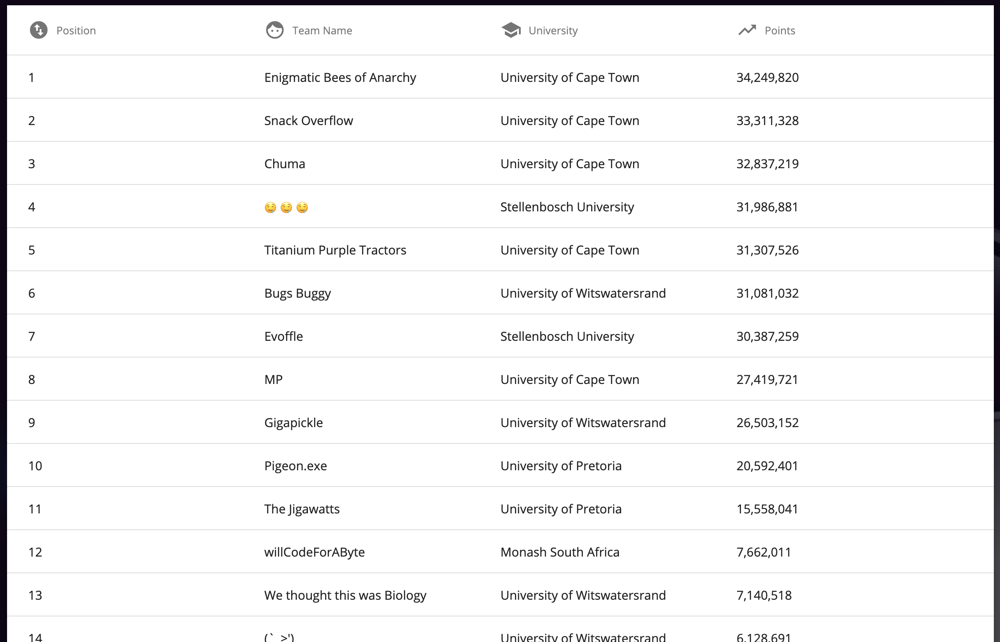

# Entelect 2020 University Challenge

We took part in the Entelect University Cup under the team name *Titatium Purple Tractors*.

We came in 5th place with 31.3 million points, 600k behind 4th place.
You can find the final code in `src/Boyd.java`.

Our per-grid scores were:

The overall per-grid scores were:

And congratulations to Enigmatic Bees of Anarchy (UCT)
for first place!

[Entelect University Challenge Website](https://challenge.entelect.co.za/university)

## Team Members:
* [Luc Hayward](https://github.com/LucHayward)
* [Stuart Mesham](https://github.com/StuartMesham)
* [Boyd Kane](https://github.com/beyarkay)

